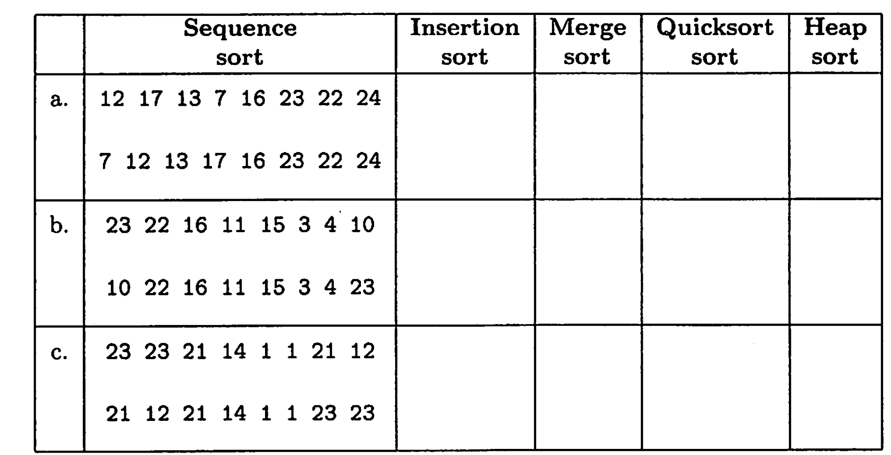

+++
date = '2025-01-06T20:37:52+08:00'
draft = false
title = '61b Lec34'
+++
## 课后习题

问：对下面的三个序列对，对每一对序列，判断第二个序列是否会出现在第一个序列的排序过程中。

答：考察插入排序、归并排序、快速排序、堆排序。我觉得这道题的难点在于要在20分钟之内解决。（试卷11道题只给了110分钟，本题占据最高的3分）
